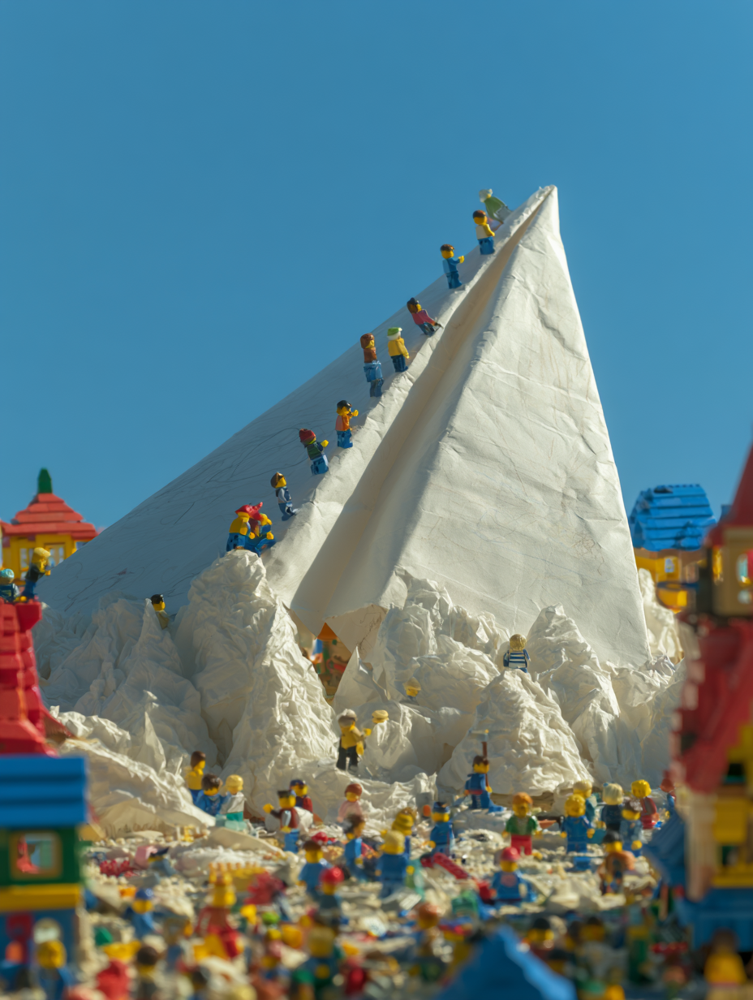
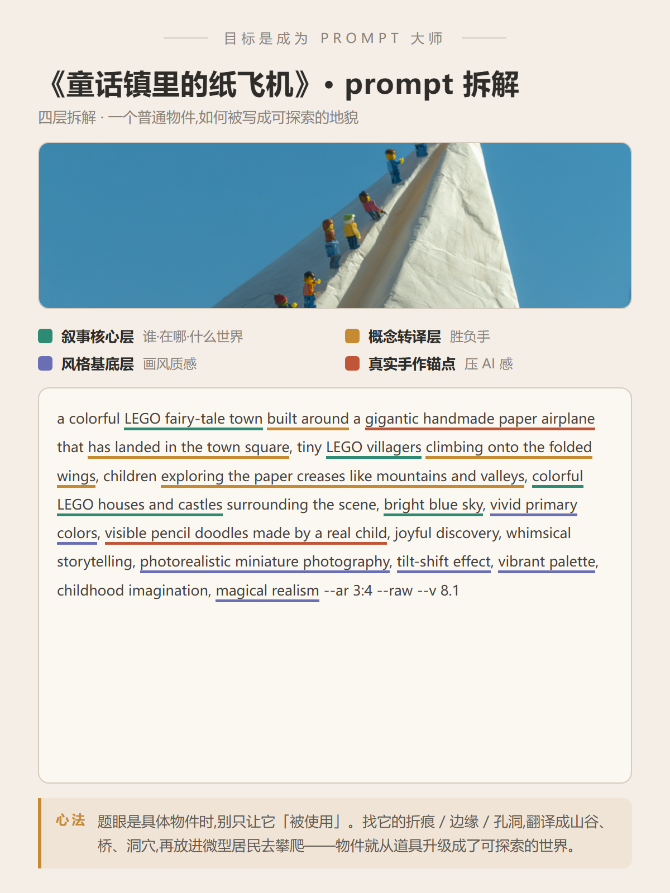

# 目标是成为 Prompt 大师 · 第 2 期《童话镇里的纸飞机》

> 封版:v1.0 · 2026-06-19 · 性质:本人获奖作品复盘
> 这是一篇可以单独阅读的笔记,不需要任何前置知识。看不懂的词,文末有「名词小抄」。

---

## 先说背景:这是一道「具体物件」题

上一期《对话》拆的是**抽象词**怎么破题。这一期反过来——题目给的是一个**很具体的东西**:**纸飞机**。

具体物件题有它自己的坑。题目越具体,大家的画法就越**集中**,于是又会撞车。「纸飞机」这个词,几乎所有人的第一反应都跑不出三种:

- 一个小孩在草地上**放飞**纸飞机
- 纸飞机**飞过**蓝天 / 城市 / 云层
- 纸飞机载着「梦想 / 信件 / 童年」**飞向远方**

共同点是:都在让纸飞机**飞**。飞,是纸飞机最被期待的动作,也正因如此——它是**撞车池**。

这篇笔记拆的,是一张**没让纸飞机飞**的纸飞机,它最后拿了奖。



---

## 一、破题:不让它飞,让它「落地变成一座山」

这张图只改了一件事,但这一件事决定了胜负:

> **它不让纸飞机飞,而是让纸飞机降落,然后变成一座可以攀爬、可以探索的「地貌」。**

画面里,一架巨大的手工纸飞机,像山脉一样插在一座 LEGO(乐高)小镇的正中央。小镇的乐高小人沿着纸飞机的折痕往上爬,把纸张的褶皱当成山谷和山脊在探索;四周是乐高的房子和城堡,衬出纸飞机有多大。

这就是这张图最值钱的一招,给它起个名字:

### 题眼物件「地貌化」

**一句话:当题眼是一个具体物件时,别只让它「被使用」,而是让它变成一个可以进入、可以攀爬、可以探索的空间。**

- 「放飞纸飞机」= 物件被使用,它只是个道具。
- 「纸飞机落地变成一座山,小人在上面探索」= 物件变成了**世界的骨架**,故事在它身上发生。

后者为什么更强?因为「放大」只是尺寸变化,而「地貌化」会**长出可以行动的故事**——有人攀爬、有人探索、整座小镇围着它发生事件。物件不再只是被看,它成了大家一起经历的一件事。

---

## 二、完整 prompt(可以直接抄)

```
a colorful LEGO fairy-tale town built around a gigantic handmade paper airplane that has landed in the town square, tiny LEGO villagers climbing onto the folded wings, children exploring the paper creases like mountains and valleys, colorful LEGO houses and castles surrounding the scene, bright blue sky, vivid primary colors, visible pencil doodles on the paper airplane made by a real child, joyful discovery, whimsical storytelling, photorealistic miniature photography, tilt-shift effect, vibrant palette, childhood imagination, magical realism --ar 3:4 --raw --v 8.1
```

> 结尾那串参数:`--ar 3:4` 是画面比例(竖版),`--raw` 让出图更写实、少「AI 美颜感」,`--v 8.1` 是 Midjourney 的版本号。换工具时这串可以删掉。

---

## 三、prompt 的四层拆解(重点看这里)

一条好 prompt 不是堆词,它分「层」,各管各的事。配套拆解卡用四种颜色标了出来:



**第 1 层 · 叙事核心层(讲故事的部分)· 绿色**
谁、在哪、什么世界:一座彩色乐高童话镇、乐高小人、四周的房子和城堡、干净蓝天。
这层定下了「这是一个安全、可爱、可以探索的玩具世界」。

**第 2 层 · 概念转译层(胜负手)· 橙色**
这是把「纸飞机」从道具变成地貌的几句关键词,也是整张图赢的地方:

- `built around`(小镇**围绕**纸飞机而建)——让纸飞机变成中心结构,而不是后加的道具。
- `has landed in the town square`(已经**降落**在广场)——给了一个「事件发生后」的状态。
- `climbing onto the folded wings`(爬上折起的机翼)、`exploring the paper creases like mountains and valleys`(把纸的折痕当成山谷和山脊去探索)——直接把纸飞机的物理结构,翻译成了可以走、可以爬的路线。

> 一句话记住:`creases like mountains and valleys`(折痕像山谷)这半句,是这张图的胜负手。它把「材质细节」一步变成了「可探索的空间」。

**第 3 层 · 风格基底层(决定画风长什么样)· 紫色**
`photorealistic miniature photography`(像真实拍出来的微缩模型)、`tilt-shift effect`(移轴效果,就是让画面像「微缩玩具世界」的那种局部清晰、四周虚化)、`vivid primary colors / vibrant palette`(高饱和的红黄蓝)、`magical realism`(魔幻现实)。
这组词决定了它**像一个真搭出来的乐高微缩场景**,而不是 3D 渲染或儿童插画。

**第 4 层 · 真实手作锚点(压住「AI 感」)· 红色**
`gigantic handmade paper airplane`(巨大的**手工**纸飞机)、`visible pencil doodles made by a real child`(上面有**真小孩画的**铅笔涂鸦)。
这两句给纸飞机加「人手的痕迹」——褶皱、皱纹、歪歪扭扭的涂鸦。纸不是干净的几何模型,而是有手工感的真实纸张。即使最后涂鸦不显眼,这股真实质感也立住了,图就不「假」。

---

## 四、这张图凭什么赢(四个赢点)

**1. 题眼变成了地貌,不只是被放大。** 见上文。物件成了世界骨架,故事自己长出来。

**2. 用「一整座小镇」做尺度参照,而不是一两个旁观者。** 巨物想让人信服,必须有参照物。乐高小人沿折痕攀爬、房屋城堡环绕、前景人群虚化——观众一眼就懂:这架纸飞机在这个世界里是「一座山」那么大,而且全镇都把它当成了一件大事。

**3. 选「乐高」这个媒介,是在给画面「叙事许可」。** 同样的画面,如果换成真实的人类小镇,巨型纸飞机砸下来会像**灾难片**——危险、压迫。换成乐高之后,大纸飞机落地不但不吓人,反而变成了游乐场和童话事件。
媒介选择不是「挑个外观风格」,而是在决定「这个画面被允许讲什么故事」。涉及童年、想象、手作、探索的主题,优先想想玩具媒介(乐高 / 积木 / 纸模 / 微缩模型)。

**4. 真实纸张质感压住了 AI 感。** 见第 4 层。

---

## 五、这套思路,你可以怎么套用

下次再遇到**具体物件**的题(钥匙、贝壳、旧书、一只鞋、一台收音机……),先别急着让它「被使用」,多问一个问题:

**这个物件,能不能变成一片可以探索的地貌?**

给你一张判断清单:

1. 这个物件能不能**飞 / 流动 / 爆发**?能 → 可以走「自然现象 / 天体事件」路线(把它放大成彗星、洪流、风暴)。
2. 这个物件有没有**折痕 / 内部 / 边缘 / 孔洞 / 纹理**?有 → 走「地貌化」:
   - 先找物件自身的结构:折痕、壳体、洞、纹路、内部空间。
   - 把结构翻译成空间功能:山脊、山谷、桥、洞穴、阶梯、广场、河道。
   - 放进**微型居民或建筑**,让大小被一眼读出来。
   - 让角色对它**发生行动**:攀爬、探索、定居、围观、修建、穿行。
3. 地貌化成立后,优先配上:**微缩摄影 + 移轴效果 + 玩具媒介**,既可爱又可信。

**边界提醒(什么时候别用):**

- 题目强调**速度、飞行、瞬间动作**时,地貌化会削弱动势,慎用。
- 物件结构太简单(比如一个光滑的球),需要额外设计可探索的细节,否则只是「大物件摆拍」。
- 媒介太写实时,巨物落地容易变灾难片——用玩具 / 童话 / 微缩摄影把危险感降下来。

---

## 名词小抄(看不懂的时候查这里)

- **prompt(提示词)**:你写给 AI 的画面描述,AI 照着它画。
- **Midjourney / MJ**:一款主流的 AI 画图工具。本期 prompt 结尾的 `--` 参数就是它的写法。
- **LEGO / 乐高**:大家熟悉的塑料积木玩具,这里指「乐高积木搭出来的世界」这种画面风格。
- **微缩摄影(miniature photography)**:拍微型模型 / 沙盘的摄影,画面像一个精致的小世界。
- **移轴 / tilt-shift**:一种让真实场景看起来像「微缩玩具模型」的效果——画面只有一条窄带清晰,上下都虚化。
- **魔幻现实(magical realism)**:写实的画面里,藏着一件不可能的事(比如一架和山一样大的纸飞机),但一切看起来又很自然。
- **撞车**:大家的图思路雷同、长得像,不出彩。
- **`--ar` / `--raw` / `--v`**:Midjourney 参数。`--ar` 画面比例,`--raw` 更写实少修饰,`--v` 版本号。换别的工具时删掉即可。
