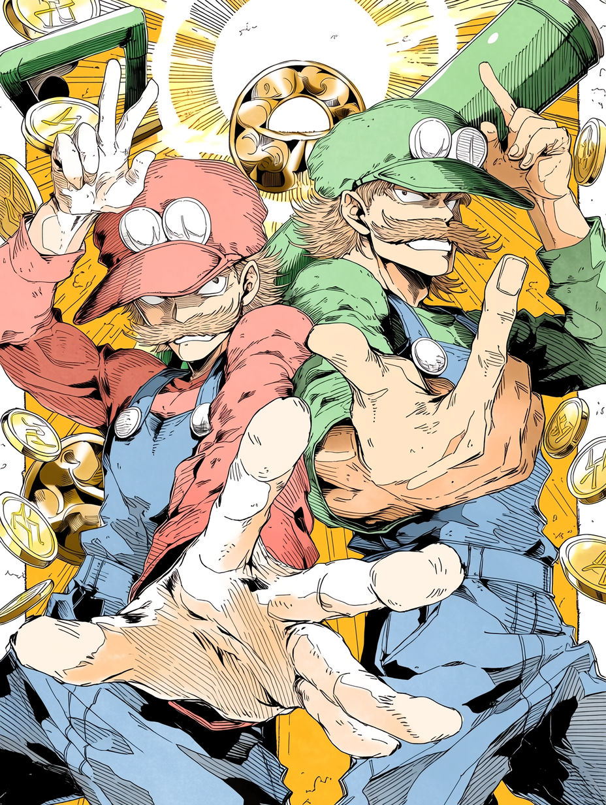
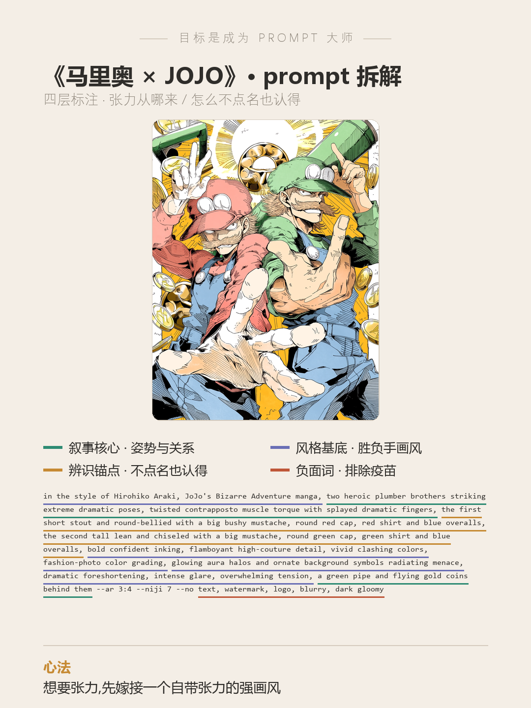

# 目标是成为 Prompt 大师 · 第 3 期《马里奥 × JOJO》

> 封版:v1.0 · 2026-06-20 · 性质:二创梗图拆解
> 这是一篇可以单独阅读的笔记,不需要任何前置知识。看不懂的词,文末有「名词小抄」。

---

## 先说背景:这一期不是「题」,是「二创」

前两期拆的是 prompt battle 的题(抽象词、具体物件)。这一期换个玩法——网上有个「二人组挑战」:一张很有张力的二人组图,问你「第一个想到的是哪两个」。我交的答卷是:**马里奥和路易吉,但画成《JOJO 的奇妙冒险》那种浮夸又带劲的画风。**



二创(拿大家都认识的角色再创作)有它自己的三个坑:

1. **要一眼认出**,但画风一换、又是剪影 / 风格化,很容易就「不像了」。
2. **要有张力、不平庸**,可张力这东西很难自己「凹」出来。
3. **还不能被工具拦下来**——直接写「Mario」「Luigi」,很多 AI 画图工具会因为版权**拒绝出图**。

这篇笔记拆的,就是怎么一次把这三个坑全绕过去。

---

## 一、破题:三招拆掉三个坑

### 第 1 招 · 选一对「身材反差」的角色

二人组好认,靠的不是脸,是**轮廓差**。马里奥**矮胖**、路易吉**瘦高**——这个体型反差,哪怕只看影子也认得出。挑二创对象时先问:**不看脸,光看身材和手里的东西,能不能认出来?** 能,这一关就稳了。

### 第 2 招 · 嫁接一个「自带张力」的强画风(胜负手)

张力别自己硬凹,**借**一个本来就以张力出名的画风。《JOJO》就是典型:夸张的扭身姿势(粉丝叫「JOJO 立ち」)、张开的五指、扑面而来的气场。把这套画风「嫁接」到马里奥身上,张力是画风自带的,你只管点名要它。

> 一句话记住:**想要张力,先嫁接一个自带张力的强画风。** 这一招是这张图赢的地方。

### 第 3 招 · 风格点名,角色不点名(关键技巧)

这是最实用的一招。很多 AI 画图工具(尤其某些大厂的)会拦截「画出可识别的版权角色」——你写「Mario」,它判定提示词安全,但**生成的图被判违规,直接出不来**。

绕过去的办法:

- **画风可以点名**:写「in the style of Hirohiko Araki(荒木飞吕彦风格)」「JoJo's Bizarre Adventure」——这是**引用一种画风**,工具一般放行。
- **角色不点名**:不写「马里奥」,改成**描述他长什么样**——红帽子红上衣、蓝背带裤、矮胖、大胡子;路易吉就是绿帽子、瘦高。
- 让人认出他的,是**配色 + 体型 + 胡子**,不是名字。

> 换句话说:**你不需要叫出他的名字,只要把他的「识别符」描述清楚,大家自己会认。**

---

## 二、完整 prompt(可以直接抄)

```
in the style of Hirohiko Araki, JoJo's Bizarre Adventure manga, two heroic plumber brothers striking extreme dramatic poses, twisted contrapposto muscle torque with splayed dramatic fingers, the first short stout and round-bellied with a big bushy mustache, round red cap, red shirt and blue overalls, the second tall lean and chiseled with a big mustache, round green cap, green shirt and blue overalls, bold confident inking, flamboyant high-couture detail, vivid clashing colors, fashion-photo color grading, glowing aura halos and ornate background symbols radiating menace, dramatic foreshortening, intense glare, overwhelming tension, a green pipe and flying gold coins behind them --ar 3:4 --niji 7 --no text, watermark, logo, blurry, dark gloomy
```

> 结尾参数:`--ar 3:4` 竖版比例,`--niji 7` 是 Midjourney 专门画动漫的最新模型(2026 年 1 月出的),`--no` 后面是「不要出现的东西」。换别的工具时这串可以删掉。

**一个诚实的说明**:这张成图,除了上面这条 prompt,我还叠加了自己账号的 **personalize**(给账号训练的一套专属审美,见名词小抄)。所以你直接抄这条 prompt,画风方向会对,但**质感细节会和我的不完全一样**——这很正常,personalize 是没法复制粘贴的。

---

## 三、prompt 的四层拆解(重点看这里)

一条好 prompt 是分「层」的,各管各的事。配套拆解卡用四种颜色标了出来:



**第 1 层 · 叙事核心层(姿势与关系)· 绿色**
`two heroic plumber brothers striking extreme dramatic poses`(两个英雄气概的水管工兄弟摆着浮夸的姿势)、`twisted contrapposto muscle torque with splayed dramatic fingers`(扭着身子、肌肉发力、五指张开)、`a green pipe and flying gold coins behind them`(身后有绿水管和飞散的金币)。
这层定下「谁、在干嘛」:两兄弟在摆 JOJO 立ち,背景还藏了只有玩过的人才懂的彩蛋。

**第 2 层 · 风格基底层(胜负手·画风)· 紫色**
`in the style of Hirohiko Araki, JoJo's Bizarre Adventure manga`(荒木飞吕彦 / JOJO 画风)、`bold confident inking`(粗重自信的墨线)、`fashion-photo color grading`(像时尚大片那样的调色,荒木招牌)、`glowing aura halos and ornate background symbols radiating menace`(发光的气场光环和华丽的背景符号,散发压迫感——对应漫画里那种「ゴゴゴ」的气势)、`dramatic foreshortening`(夸张的透视)、`overwhelming tension`(满到溢出的张力)。
**这层就是这张图的胜负手**:张力全是这组词带来的。

**第 3 层 · 辨识锚点层(不点名也认得)· 金色**
`the first short stout and round-bellied ... round red cap, red shirt and blue overalls`(第一个矮胖、圆肚子、红帽红衫蓝背带)、`the second tall lean and chiseled ... round green cap, green shirt`(第二个瘦高、绿帽绿衫)。
这层不写名字,纯靠**配色 + 体型 + 大胡子**让人认出是谁。它替你绕过了版权拦截。

**第 4 层 · 负面词疫苗(排除项)· 红色**
`--no text, watermark, logo, blurry, dark gloomy`。
不要文字、水印、logo、模糊;特别加了 `dark gloomy`(阴郁)——因为我不要悲剧调,要的是热血张力,就用负面词把阴郁挡在门外。

---

## 四、这张图凭什么成立(四个点)

**1. 张力是「借」来的,不是「凹」的。** 选了 JOJO 这个自带张力的画风,你只管点名,气场它自己就有了。这比自己堆「dynamic、powerful」这种空词管用得多。

**2. 不点名,也让人一眼认出。** 靠红/绿配色 + 矮胖/瘦高 + 大胡子,绕过版权拦截还不丢辨识。这一招可以套到几乎任何知名角色的二创上。

**3. 背景藏了「第二眼彩蛋」。** 绿水管和金币,是只有玩过马里奥的人才会心一笑的细节。第一眼看张力,第二眼发现彩蛋——这是让人多停留、想转发的钩子。

**4. 最后一脚靠 personalize 提质感。** 同样的 prompt,叠不叠账号的 personalize,出来是「能看」和「很想要」的差别。这点前面已经诚实说明。

---

## 五、这套思路,你可以怎么套用

想做任意知名角色的二创(不只马里奥),套这个公式:

```
选辨识锚点(配色 / 体型 / 标志物,别靠名字)
  + 嫁接一个自带张力 / 气质的强画风(点名画风)
  + 角色用描述、不用商标名(绕过版权拦截)
  + 背景藏一个「第二眼彩蛋」(给懂的人会心一笑)
```

一张判断清单:

1. 这个角色**最强的识别符**是什么?(颜色?体型?一件标志物?)→ 写进 prompt,别写名字。
2. 我想要什么**气质 / 张力**?→ 找一个以此出名的画风去**点名嫁接**(要热血找 JOJO、要唯美找某某、要复古找某某)。
3. 有没有一个**只有粉丝懂的细节**可以藏进背景?→ 放进去当第二眼彩蛋。
4. 直接写角色名被工具拦了?→ 改成「描述长相 + 点名画风」。

**边界提醒(什么时候别硬套):**

- 角色的识别**高度依赖脸**(而不是配色 / 体型)时,纯描述容易翻车,可能需要参考图。
- 嫁接的画风和角色**气质冲突太大**时(比如给搞笑角色配极致悲剧画风),会从「反差萌」滑向「别扭」,先小图试。
- 涉及版权角色,**自己发布前想清楚平台规则**;二创注明「同人 / 二创」更稳妥。

---

## 名词小抄(看不懂的时候查这里)

- **prompt(提示词)**:你写给 AI 的画面描述,AI 照着它画。
- **Midjourney / MJ**:一款主流的 AI 画图工具。
- **niji 7**:Midjourney 旗下**专门画动漫 / 漫画**的模型,2026 年 1 月发布的最新版,出二次元画风更准。用法是在 prompt 结尾加 `--niji 7`。
- **JOJO / 荒木飞吕彦**:《JOJO 的奇妙冒险》是日本知名漫画,作者荒木飞吕彦,以浮夸的姿势、强烈的张力和独特调色出名。
- **JOJO 立ち(JOJO 站姿)**:粉丝对书里那种扭着身子、摆出时装模特般夸张姿势的统称,本身就是个网络梗。
- **二创**:二次创作,拿大家已经认识的角色 / 作品再创作。
- **personalize(个性化)**:Midjourney 的一个功能,你给它喂自己的审美偏好,它训练出一套「你专属的画风底盘」,之后出图会更合你口味。它绑定账号,**没法像 prompt 那样复制给别人**。
- **`--ar` / `--niji` / `--no`**:Midjourney 参数。`--ar` 画面比例,`--niji` 动漫模型版本,`--no` 后面跟「不要出现的元素」。换别的工具时删掉即可。
